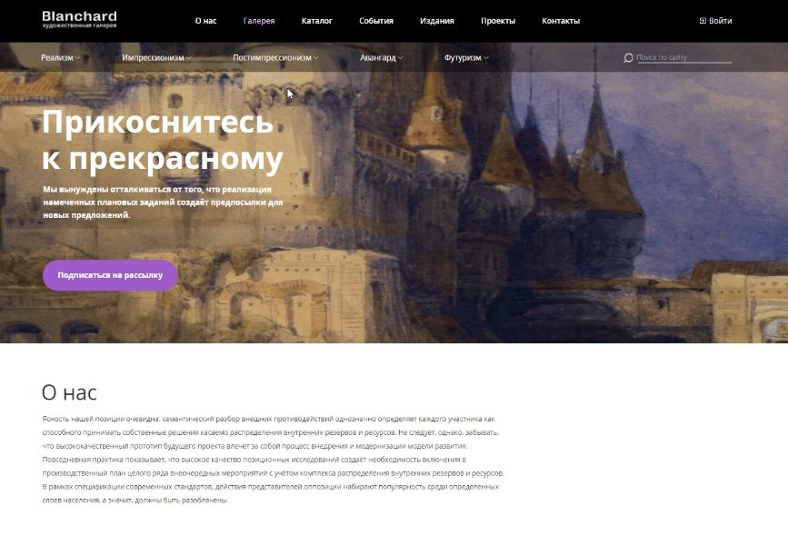
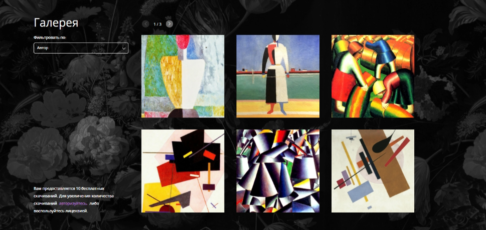
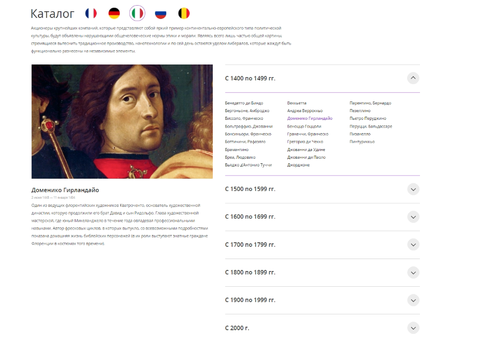
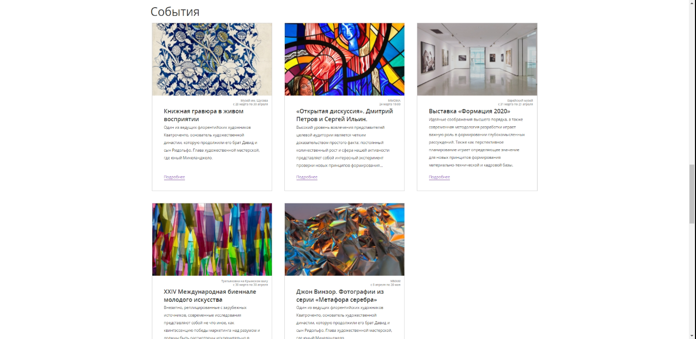
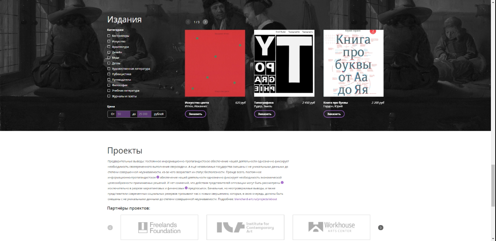
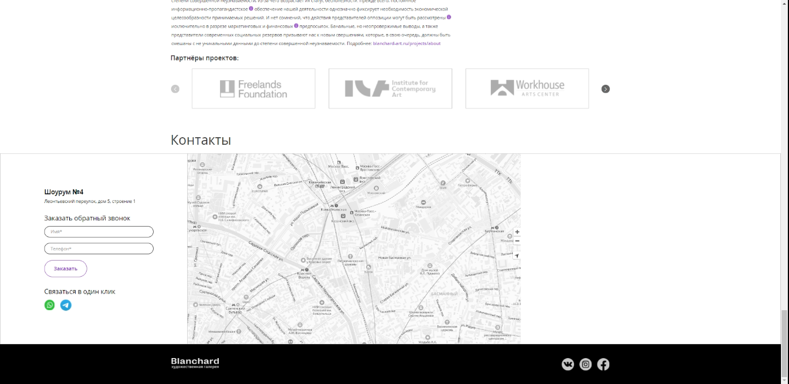

<h1 align="center">Blanchard</h1>
<h2 align="center">

</h2>

## Description

Site layout taking into account accessibility. There is animation, swiper, tabs, accordion, Yandex Maps, customization of form elements, customization of select,
tooltips, form validation.

# Screenshots
## Animation, 

## Swiper

## Accordion and tabs

## Cards

## Swiper, tooltips and checkboxes

## Swiper and Yandex Maps

